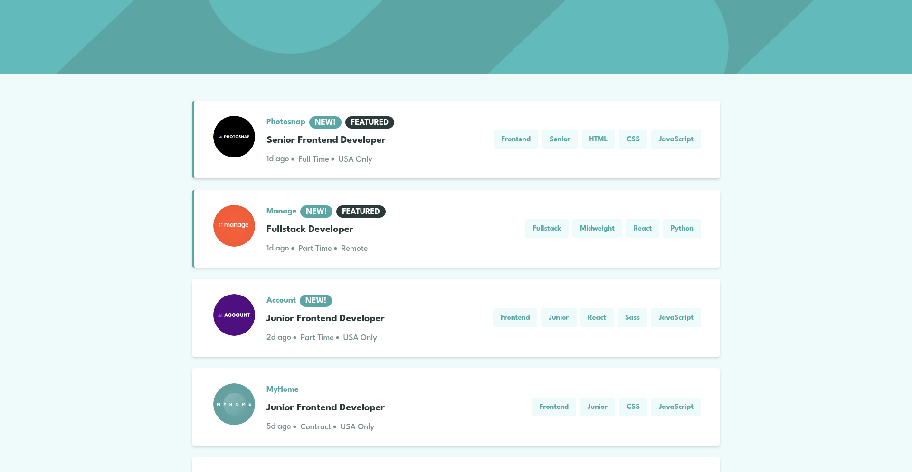

# Frontend Mentor - Job listings with filtering solution

This is a solution to the [Job listings with filtering challenge on Frontend Mentor](https://www.frontendmentor.io/challenges/job-listings-with-filtering-ivstIPCt). Frontend Mentor challenges help you improve your coding skills by building realistic projects.

## Table of contents

- [Overview](#overview)
  - [The challenge](#the-challenge)
  - [Screenshot](#screenshot)
  - [Links](#links)
- [My process](#my-process)
  - [Built with](#built-with)
  - [Continued development](#continued-development)
  - [Useful resources](#useful-resources)
- [Author](#author)
- [Acknowledgments](#acknowledgments)
- [Daily summaries](#daily-summaries)

## Overview

### The challenge

Users should be able to:

- View the optimal layout for the site depending on their device's screen size
- See hover states for all interactive elements on the page
- Filter job listings based on the categories

### Screenshot

### Links

- URL: [https://florianstancioiu.github.io/static-job-listings/](https://florianstancioiu.github.io/static-job-listings/)
- Solution URL: [https://www.frontendmentor.io/solutions/responsive-job-listings-with-react-and-typescript-XEpvUaOCwr](https://www.frontendmentor.io/solutions/responsive-job-listings-with-react-and-typescript-XEpvUaOCwr)

## My process

### Built with

- Semantic HTML5 markup
- CSS custom properties
- Flexbox
- CSS Grid
- Mobile-first workflow
- [React](https://reactjs.org/) - JS library
- [TypeScript](https://www.typescriptlang.org/) - JavaScript with types
- [TailwindCSS](https://tailwindcss.com/) - For styles
- [Vite](https://vite.dev/) - Build tool

### Continued development

- I would test the app using React Testing Library
- I would add Storybook to the project
- I would take my time to make the website more accessible to keyboard users

### Useful resources

- [Gustavo's filterJobs.ts file](https://github.com/gusanchefullstack/fsdev-job-listings-with-filtering/blob/main/src/utils/filterJobs.ts) - This saved me countless hours of tweaking the filter functionality so that it actually works correctly... I'm not proud that I used it but it works, and it saved me a ton of time.

## Author

- Frontend Mentor - [@florianstancioiu](https://www.frontendmentor.io/profile/florianstancioiu)
- Threads - [@florianstancioiu01](https://www.threads.com/@florianstancioiu01)
- LinkedIn - [florianstancioiu](https://www.linkedin.com/in/florian-stancioiu-765661349/)
- freeCodeCamp - [florianstancioiu](https://www.freecodecamp.org/florianstancioiu)

## Acknowledgments

- [Gustavo Sanchez](https://www.frontendmentor.io/solutions/job-listings-with-filtering-solution-0jkb7q0x9d) - I used Gustavo's way of filtering the Jobs, I used the 2 functions inside `src/utils/filterJobs.ts`

## Daily summaries

| Date          | Time Spent | Summary                       |
| ------------- | ---------- | ----------------------------- |
| May 1st, 2026 | 2.5 hours  | I worked on the mobile design |
| May 3rd, 2026 | 2.5 hours  | I worked on the mobile design |

_Total time spent working on the project:_ **5 hours**
